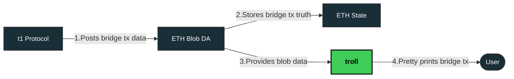

## Overview

`troll` is an aspirational web app for monitoring bridging interactions as they're implemented on the `t1` protocol. As such, it provides a simplified interface for interrogating blobs. `troll` was written in TypeScript using `create-next-app` and [ethers.js](https://github.com/ethers-io/ethers.js).

### How it works
To get a better understanding of why this app was created, it's best to know how `t1` works. At a high level,
`t1` attempts bridging via the following mechanism:

- Users deposit funds to a t1 bridge contract on Ethereum or a Partner Rollup
- t1 Sequencers order partially-encrypted transactions into blocks using Espresso HotShot consensus
- TEE-enabled Executors decrypt and execute these transactions, then reach consensus on the new state
- Executors post the new state and consensus proofs to Ethereum's Canonical Bridge contract
- Transaction data is posted to **Ethereum Blob DA, serving as the single source of truth**

That's where `troll` comes in. `troll` works by serving and interpreting blob data (and, as necessary, smart contract txs) in order to determine the state of a bridging transaction. It can be visiualized as the following:



> [!NOTE]
> troll is currently in its infancy! As of right now, troll only works by viewing blobs on Ethereum mainnet. Additional support and features are planned.
> For more information about the `t1` protocol check out this informative [post](https://t1protocol.substack.com/p/introducing-t1-unifying-ethereums-ecosystem)


## Design Considerations 🧌
`troll` is designed with a minimal and interactive web UI for responsiveness and simplicity. Compared to most block explorers and utilities, `troll` is no frills! Developers who are simply looking for blob data or bridge status will require few or no clicks.


Successful queries generate their own URL formatted as such:

```
{base_url}/blob/{full_tx_hash}
```

By default unsuccessful queries do not generate a URL, although one can be manually accessed or alternatively gotten through QR code.
Unique QR codes are generated and can be used as a shortcut for accessing any tx hash, valid or invalid.

> [!TIP]
> Each request currently causes page UI elements to reload. An API which returns bridging tx status, alongside blob data and metadata as `JSON` are planned, but not yet implemented.

## Implementation Roadmap ✅

### Features 🎊
* [x] Ethereum `mainnet` blob metadata fetching
* [x] Unique URL look-up through WebUI
* [x] On-the-fly QR Code Creation for tx hashes

### To Do 📋
* [ ] Track `t1` devnet deposit txs
* [ ] Add support for more networks (esp. `sepolia`)
* [ ] Add cutesy bridge animation to show tx bridging state
* [ ] Implement RPC provider fallbacks (right now it's hardcoded to ankr public RPC)


## Live Site ✨

The site is currently deployed using vercel and can be seen at the following url:

> https://troll-snowy.vercel.app

> [!IMPORTANT]
> All pushes to this repository result in new builds at the aforementioned URL. Please test a full build on a separate branch before pushing to `main`

## Do It Yourself 🔨

### Run
First, run the development server:

```bash
npm run dev
# or
yarn dev
# or
pnpm dev
# or
bun dev
```

Open [http://localhost:3000](http://localhost:3000) with your browser to see the result.

### Build

You may also want to build locally to do a full test! This is recommended if you're planning to contribute. Please do the following:
Make sure you have the following dependencies installed:

```bash
npm i clsx tailwind-merge
```

then

```bash
npm run build
```

if you're using a diferent package manager please substitute for the appropriate commands!
